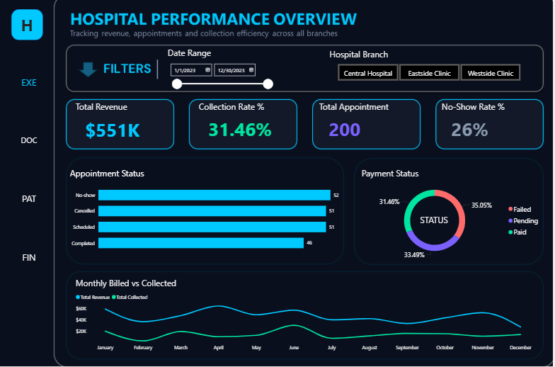
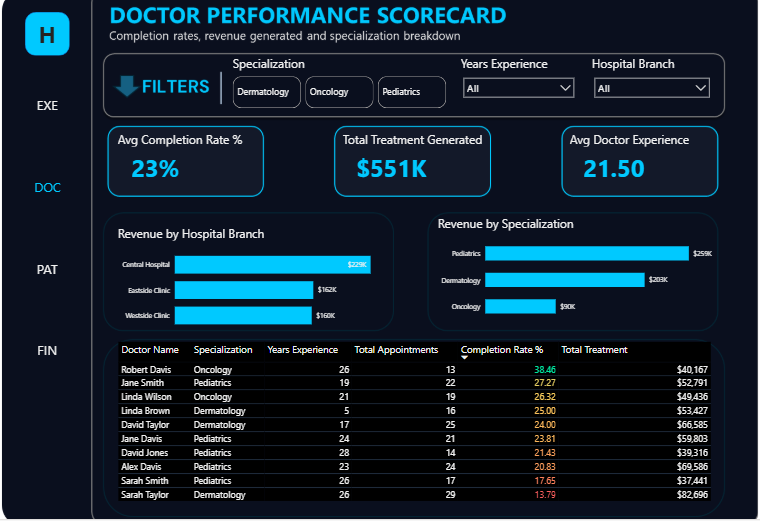
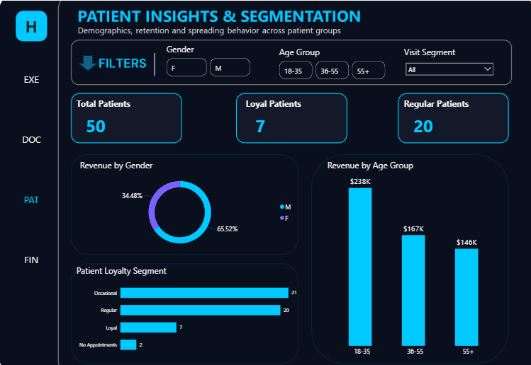
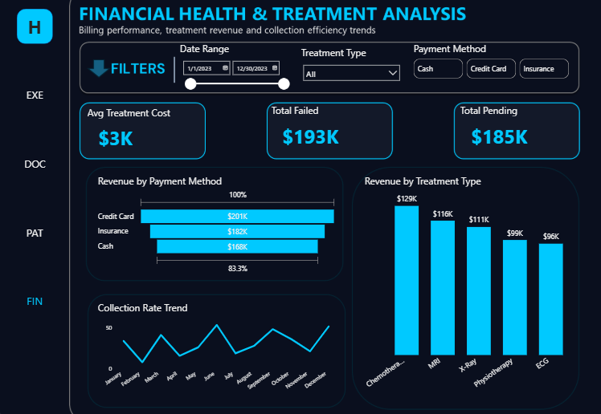
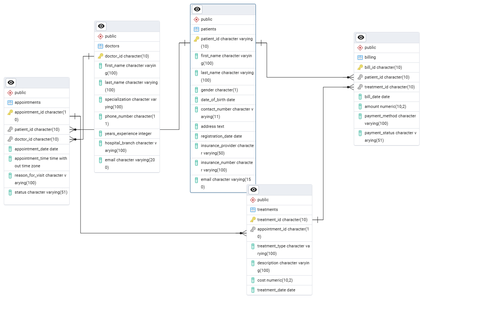
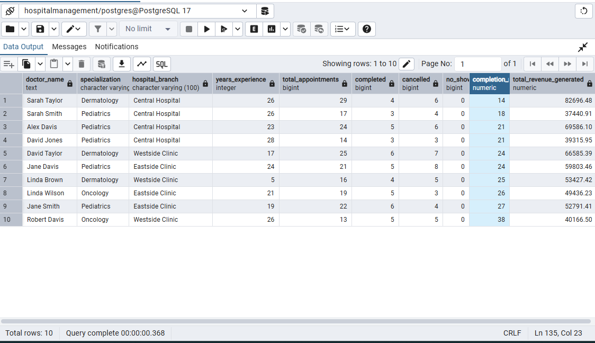
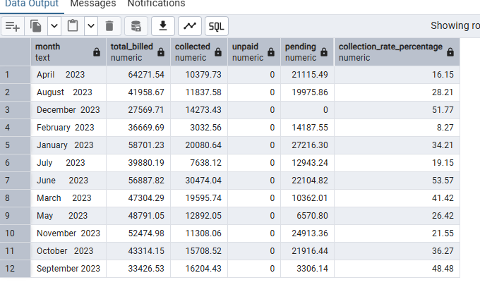

# Hospital Management SQL Analysis

## Project Overview
An end-to-end SQL analysis of a hospital management database covering 50 patients, 10 doctors across 3 branches and 12 months of billing data (2023). The goal was to extract actionable business insights that support hospital management decisions and not just 
handle data.

---

## Business Problem
The hospital needed to understand:
- Why revenue collection is low  
- Which doctors and branches are underperforming  
- How patient behavior affects revenue and operations 

---

## Live Dashboard
[View Interactive Dashboard](https://app.powerbi.com/view?r=eyJrIjoiZDY4ZWVjYTktZmZhYi00MzZmLTg0YmYtZGIyYzJjZWRmZDVlIiwidCI6ImI5YmM1OTJjLWQ0MDMtNDJhMi1hNDIxLWY0ZmNkN2Q5MjljYyJ9)

---

## Dashboard Preview

### Executive Summary

### Doctor Performance

### Patient Insights

### Financial Health

---

## Database Schema
**5 relational tables:**
- Patients (50 records)
- Doctors (10 records)
- Appointments (200 records)
- Treatments (155 records)
- Billing (200)

---

## Entity Relationship Diagram
The diagram below shows how all 5 tables are connected through foreign keys:

Key Relationships:
- Patients → Appointments (one patient, many appointments)
- Doctors → Appointments (one doctor, many appointments)
- Appointments → Treatments (one appointment, one treatment)
- Patients → Billing (one patient, many bills)
- Treatments → Billing (one treatment, one bill)
  
---

## Tools Used
- PostgreSQL 17  
- pgAdmin  
- Power BI   
- DAX
  
---

## SQL Techniques Used
- Window Functions (`RANK`, `SUM OVER`, `COUNT OVER`)  
- Conditional Aggregation (`CASE WHEN`)  
- Subqueries  
- Date Functions (`DATE_TRUNC`, `EXTRACT`, `AGE`, `TO_CHAR`)  
- Views (7 reusable views created)  
- Joins (`LEFT JOIN`, `INNER JOIN`)  
- `NULLIF` for safe division  
- Foreign Keys & relational design

--- 

## Key Business Findings

### Revenue
- Total billed: **$551,249.85**  
- Total collected: **$173,424.90 (31.47%)**  
- Failed payments: **$193,212.94** (exceeds collections)  
- Worst month: **February (8.27%)**  
- Best month: **June (53.57%)**

### Appointments
- Total: **200**
- Completed: **46 (23%)**
- No-shows: **52 (26%)**
- Cancelled: **51 (25.5%)**
> No-shows exceed completed appointments

### Doctors & Branches
- Top doctor: **Robert Davis (Oncology)**  
  - 38% completion rate  
  - $40,166 revenue  
- Top branch: **Central Hospital ($229,039)**  
- Lowest branch: **Westside Clinic ($160,179)**  

### Patients
- Total: **50 patients**
- Loyal (More than 6 visits): 7 patients — 14%
- Regular (4-6 visits): 20 patients — 40%
- Occasional (2-3 visits): 21 patients — 42%
- No appointments recorded: 2 patients

### Treatments
- Top revenue driver: **Chemotherapy ($128,855)**  
- Followed by:
  - MRI: $116,098  
  - X-Ray: $110,653

--- 

## Key Insights & Business Impact

### Revenue Collection Crisis
The hospital billed $551,249 but retained only 31.47% of it. Failed payments ($193,212) exceeded total successful collections ($173,424), meaning the hospital lost more money than it kept. February 2023 was the lowest point at 8.27% collection rate against an 80% industry benchmark.

### Attendance Problem 
Out of 200 scheduled appointments only 46 were completed while 52 were no-shows. The hospital is losing a quarter of its scheduled revenue before treatment even begins. Saturday recorded a perfect 0% no-show rate. The problem is not patients, it is weekday scheduling and follow-up.

### Performance Gap Between Doctors
Robert Davis in Oncology leads all doctors with a 38% completion rate and $40,166 in revenue. The gap between the top and bottom performing doctors is too significant to be explained by patient volume alone. This points to scheduling inefficiencies, patient management differences or branch level resource issues that need management attention.

### Branch Performance Divide
Central Hospital generated $229,039 while Westside Clinic generated $160,179, a $69,000 difference between two branches of the same organization. Patients, doctors and treatments are similar across branches yet results are not. The operating model at Central Hospital is clearly working better and deserves to be studied and replicated.

### Patient Acquisition Gap
The hospital shows strong engagement, 40% of patients are Regular visitors and 14% are highly committed Loyal patients. But 50 total patients across 3 branches and 10 doctors means each doctor serves just 5 patients on average. Retention is working. Acquisition is the crisis that no retention strategy can solve alone.

---

## Recommendations
1. Urgent billing overhaul 31.47% collection rate is critically below the 80% benchmark
2. Investigate $193,212 in failed payments immediately
3. Shift more appointments to Saturdays, 0% no-show rate
4. Implement SMS reminders 24 hours before appointments
5. Replicate Central Hospital strategy across other branches
6. Launch patient acquisition programs urgently
7. Build post-treatment follow-up for Chemotherapy patients

---

## Query Results Preview

### Doctor Performance Scorecard

### Monthly Revenue Analysis

### Appointment Status Breakdown

---

## Limitations	
- Dataset is synthetic (Kaggle generated) so findings reflect simulated patterns not a real hospital
- 50 patients is a small sample size which may affect the reliability of percentage based insights
- No staff cost or operational expense data available so true profitability cannot be calculated
- Payment failure reasons are not captured making root cause analysis impossible

---

## What I Learned 
- How to use window functions to rank and compare within groups without collapsing rows
- How to build reusable views that separate analysis logic from raw data
- How to design a Power BI data model using raw tables and DAX measures
- How to validate Power BI numbers against SQL views before publishing
- How to frame data findings as business recommendations not just observations

---

## Project Structure

- 1_create tables.sql
- 2_data cleaning.sql
- 3_revenue analysis.sql
- 4_doctor performance.sql
- 5_operational analysis.sql
- 6_patient analysis.sql
- 7_treatment analysis.sql
- 8_Views.sql
  
- dashboard/
  -  dashboard_page1.png
  -  dashboard_page2.png
  -  dashboard_page3.png
  -  dashboard_page4.png

 - results/
    - doctor_performance_result.png
    - monthly_revenue_result.png
    - appointment_status_result.png

  - assets/
    - hospital_erd.png

